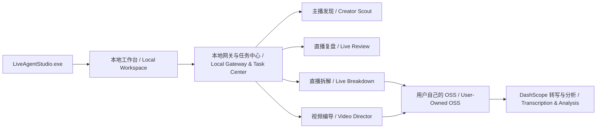

### 面向直播电商团队的 Windows 本地优先 AI 工作台
### A local-first AI workspace for livestream commerce teams on Windows

把主播发现、直播拆解、直播复盘和短视频编导放进一个统一入口。

Bring creator discovery, livestream breakdown, performance review, and short-form video planning into one unified workspace.

## 项目维护者 / Maintainers

- [HanyuanWang](https://github.com/HanyuanWang)
- [JialiangFu](https://github.com/JialiangFu)


</div>

> [!IMPORTANT]
> 请先使用非敏感素材验证环境、账号权限和输出结果，再投入正式业务。
>
> Before using LiveAgent Studio in production, validate your environment, account permissions, and output quality with non-sensitive test materials.

LiveAgent Studio 是面向直播电商团队打造的 Windows 本地优先 AI Agent 工作台。

LiveAgent Studio is a local-first Windows AI Agent workspace built for livestream commerce teams.

本版本将主播发现、直播拆解、话术与流量复盘、短视频内容编导整合到统一入口，帮助直播运营、投放、内容和复盘团队，将榜单、录屏、逐字稿、流量数据与脚本资产沉淀为可追踪、可复用的完整工作流。

It brings creator discovery, livestream breakdown, speech-and-traffic review, and short-form video planning into a single interface. The goal is to help operations, media-buying, content, and review teams turn rankings, recordings, transcripts, traffic data, and scripts into traceable and reusable workflows.

这是项目的首个公开 Beta 版本，适合体验、测试和内部研究使用。

This is the project's first public Beta release. It is intended for evaluation, testing, and internal research.

---

## ✨ 核心能力
## ✨ Core Capabilities

### 01 · Creator Scout Agent｜主播发现

管理关注领域、候选主播和达人研究任务，读取用户账号正常可见的蝉妈妈榜单或主播页面，生成结构化达人拆解，并将候选主播加入后续可选录制流程。

Manage research categories, candidate creators, and creator-analysis tasks. The Agent can read Chanmama rankings or creator pages normally visible to the signed-in user, generate structured creator profiles, and add selected creators to an optional recording workflow.

### 02 · Live Breakdown Agent｜直播拆解

将完整直播视频转化为带秒级时间戳的结构化逐字稿，自动完成音频提取、云端转写和内容整理，并输出可继续分析的 Excel 文件。

Convert full-length livestream recordings into structured transcripts with second-level timestamps. The workflow extracts audio, submits it for cloud transcription, organizes the content, and exports an Excel workbook ready for further analysis.

### 03 · Live Review Agent｜直播复盘

对齐直播逐字稿与同场分钟级流量数据，分析不同话术阶段对应的进入、离开、在线、停留、互动、商品曝光与点击变化，输出 Excel 和 Word 复盘报告。

Align a livestream transcript with minute-level traffic data from the same session. Analyze how different speech stages relate to changes in entries, exits, concurrent viewers, watch time, engagement, product impressions, and product clicks. Results are exported as Excel and Word reports.

### 04 · Video Director Agent｜短视频编导

根据用户提供的参考短视频链接提取真实逐字稿，在保留内容逻辑而非复制原文的前提下，生成原创口播脚本、内容结构、分镜与拍摄建议。

Extract a verified transcript from a short-video reference link supplied by the user. Based on the reference's underlying content logic—without copying its wording—the Agent generates an original spoken script, content structure, storyboard, and production recommendations.

### Unified Task Center｜统一任务中心

集中查看任务进度、运行状态、失败原因和输出文件，减少在多个脚本、文件夹和工具之间反复切换。

Track task progress, runtime status, failure reasons, and output files in one place, reducing the need to switch repeatedly between scripts, folders, and tools.

### Local Settings Hub｜本地设置中心

统一配置用户自己的阿里云百炼 DashScope、OSS、平台登录状态，以及可选的直播录制助手路径。

Configure your own Alibaba Cloud Model Studio (DashScope), OSS storage, platform sign-in state, and the optional path to a local livestream recording assistant.

## 四个 Agent
## Four Agents

| Agent | 输入 / Input | 主要工作 / What It Does | 输出 / Output |
| --- | --- | --- | --- |
| 主播发现<br>Creator Scout | 关注领域、用户账号可见的蝉妈妈榜单或主播主页<br>Research categories and Chanmama rankings or creator pages visible to the user's account | 管理候选主播、生成达人拆解、加入可选录制流程<br>Manages candidates, produces creator profiles, and optionally adds creators to a recording workflow | 候选主播库、达人报告、录制名单<br>Candidate library, creator reports, and recording list |
| 直播拆解<br>Live Breakdown | 完整直播视频<br>Full-length livestream video | 提取音频、云端语音转写、按内容组织事件和逐字稿<br>Extracts audio, runs cloud speech transcription, and organizes events and transcripts | 带秒级时间戳的拆解 Excel<br>Breakdown workbook with second-level timestamps |
| 直播复盘<br>Live Review | 直播视频、同场巨量百应分钟流量表<br>Livestream video and minute-level Ocean Engine E-commerce traffic data from the same session | 对齐逐字稿与进入、离开、在线、停留、互动、商品曝光和点击变化<br>Aligns speech with entries, exits, concurrent viewers, watch time, engagement, product impressions, and clicks | 复盘 Excel、Word 和处理说明<br>Excel and Word review reports, plus processing notes |
| 视频编导<br>Video Director | 用户主动粘贴的参考短视频链接<br>Short-video reference links submitted by the user | 提取真实参考逐字稿，基于有效素材生成原创方案<br>Extracts a verified reference transcript and creates an original content plan from valid source material | 原创脚本、分镜和拍摄建议<br>Original script, storyboard, and production guidance |

## 快速开始
## Quick Start

### 1. 下载
### 1. Download the Release

在仓库右侧进入 **Releases**，下载：

Open **Releases** on the right side of the repository and download:

- `LiveAgent-Studio-Windows-x64.zip`
- `LiveAgent-Studio-Windows-x64.zip.sha256`

不要只下载源码，也不要只复制 EXE。完整运行需要 ZIP 内的 `.runtime` 和各 Agent 目录。

Do not download only the source archive or copy only the executable. The application requires the `.runtime` directory and the bundled Agent directories included in the ZIP package.

### 2. 校验文件
### 2. Verify the Download

在 ZIP 所在目录打开 PowerShell：

Open PowerShell in the directory containing the ZIP file:

```powershell
(Get-FileHash .\LiveAgent-Studio-Windows-x64.zip -Algorithm SHA256).Hash
```

确认结果与 `.sha256` 文件中的值一致。无法确认下载来源或校验不一致时，请不要运行。

Confirm that the resulting hash matches the value in the `.sha256` file. Do not run the package if the hash does not match or if you cannot verify the download source.

### 3. 解压并启动
### 3. Extract and Launch

完整解压 ZIP，然后双击：

Extract the entire ZIP archive, then double-click:

```text
LiveAgentStudio.exe
```

程序准备好后会自动在默认浏览器打开 `http://127.0.0.1:4173/`。

When the local service is ready, the application opens `http://127.0.0.1:4173/` in your default browser.

当前 Beta 启动器尚未使用商业代码签名证书，Windows 可能显示 SmartScreen 提示；请只运行从本仓库 Releases 下载且校验一致的文件。

The current Beta launcher is not signed with a commercial code-signing certificate, so Windows SmartScreen may display a warning. Only run packages downloaded from this repository's official Releases page and verified against the published SHA-256 checksum.

### 4. 完成首次设置
### 4. Complete the Initial Setup

进入左侧 **设置与连接**，根据页面引导配置：

Open **Settings & Connections** from the sidebar and configure:

1. 自己的阿里云百炼 DashScope API Key。  
   Your Alibaba Cloud Model Studio DashScope API key.
2. 私有 OSS Bucket。  
   Your private OSS bucket.
3. 仅覆盖指定 Bucket/对象前缀的 RAM AccessKey。  
   A RAM AccessKey restricted to the required bucket and object prefix.
4. 如需“加入快抖录制”，再粘贴本机录制助手 EXE 的完整路径；这是可选项。  
   Optional: paste the full local path to the recording assistant executable if you want to use **Add to Kuaidou Recording**.

保存后点击“实际验证 Qwen 与 OSS”。验证通过后，再开始直播拆解或复盘任务。

Save the settings and select **Verify Qwen & OSS**. Start a breakdown or review task only after the verification succeeds.

## 数据如何流动
## How Data Flows

| 数据 / Data | 默认位置或去向 / Default Location or Destination |
| --- | --- |
| 任务记录、数据库、输出文件<br>Task history, database, and generated files | 当前电脑的项目 `workspace`<br>The project's local `workspace` directory |
| 蝉妈妈、抖音登录状态<br>Chanmama and Douyin sign-in state | 当前电脑的专用浏览器 Profile<br>A dedicated browser profile on the local machine |
| API Key 与 OSS 凭据<br>API keys and OSS credentials | 当前电脑被 Git 忽略的 `.env`，Windows 下限制为当前用户和 SYSTEM 访问<br>A Git-ignored local `.env` file, restricted on Windows to the current user and SYSTEM |
| 转写音频<br>Audio used for transcription | 临时上传到用户自己的 OSS，再交给 DashScope 读取<br>Temporarily uploaded to the user's own OSS bucket, then accessed by DashScope |
| OSS 临时音频<br>Temporary OSS audio | 任务结束后程序尝试删除<br>The application attempts to delete it when the task finishes |
| 抖音下载 Cookie 文件<br>Douyin download cookies | 仅在处理期间临时生成，使用后立即删除<br>Generated only while needed and deleted immediately after use |

LiveAgent Studio 不附带任何开发者 API Key、Cookie、浏览器 Profile 或真实业务数据。云端转写会使用用户自己的阿里云账号并产生相应费用。

LiveAgent Studio does not include developer API keys, cookies, browser profiles, or real business data. Cloud transcription and model calls use the user's own Alibaba Cloud account and may incur charges.

---

## 🧩 使用前需要准备什么
## 🧩 Prerequisites

LiveAgent Studio 提供本地工作台和工作流编排，但不会附带第三方账号、会员、云服务额度或外部录制软件。

LiveAgent Studio provides the local workspace and workflow orchestration layer. It does not include third-party accounts, subscriptions, cloud-service credits, or external recording software.

### 基础运行环境
### Basic System Requirements

- Windows 10 或 Windows 11，64 位系统。  
  Windows 10 or Windows 11, 64-bit.
- Microsoft Edge、Google Chrome 或其他现代浏览器。  
  Microsoft Edge, Google Chrome, or another modern browser.
- 稳定的网络连接。  
  A stable internet connection.
- 足够的磁盘空间，用于直播视频、逐字稿、临时文件和复盘报告。  
  Sufficient disk space for livestream recordings, transcripts, temporary files, and review reports.
- Microsoft Excel、Word，或能够打开 `.xlsx`、`.docx` 的 WPS Office 等兼容软件。  
  Microsoft Excel and Word, WPS Office, or other software capable of opening `.xlsx` and `.docx` files.

### 阿里云服务
### Alibaba Cloud Services

直播拆解、转写和部分 AI 分析功能需要用户自行准备：

Livestream breakdown, transcription, and selected AI analysis features require users to provide:

- 阿里云账号。  
  An Alibaba Cloud account.
- 阿里云百炼 DashScope API Key。  
  An Alibaba Cloud Model Studio DashScope API key.
- 用户自己的私有 OSS Bucket。  
  A private OSS bucket owned by the user.
- OSS Endpoint、AccessKey ID 和 AccessKey Secret。  
  An OSS endpoint, AccessKey ID, and AccessKey Secret.
- 可用的模型与云服务额度。  
  Access to the required models and sufficient cloud-service quota.

云端转写和模型调用会使用用户自己的阿里云账号，并可能产生费用。请在阿里云控制台查看实际计费规则和用量。

Transcription and model calls use the user's own Alibaba Cloud account and may incur charges. Refer to the Alibaba Cloud console for current pricing and usage information.

### 蝉妈妈
### Chanmama

主播发现相关功能可能需要：

Creator discovery may require:

- 用户自己的蝉妈妈账号。  
  The user's own Chanmama account.
- 正常登录状态。  
  An active sign-in session.
- 对应榜单、主播页面或数据模块的会员权限。  
  The subscription level required to view the relevant rankings, creator pages, or data modules.

软件只读取当前账号正常可见的页面，不会绕过登录、验证码、会员限制或平台风控。

The application only reads pages normally available to the current account. It does not bypass authentication, CAPTCHA challenges, subscription restrictions, or platform risk controls.

### 抖音
### Douyin

短视频解析、主播页面和部分内容读取可能需要：

Short-video parsing, creator pages, and selected content-reading workflows may require:

- 用户自己的抖音账号。  
  The user's own Douyin account.
- 正常登录状态。  
  An active sign-in session.
- 必要时完成验证码或访问状态刷新。  
  Completion of CAPTCHA verification or a refreshed access session when requested by the platform.

部分链接可能因平台风控、内容权限、地区限制、链接失效或页面变化而无法读取。

Some links may be unavailable because of platform risk controls, content permissions, regional restrictions, expired links, or page changes.

### 巨量百应
### Ocean Engine E-commerce

直播复盘建议准备同一场直播对应的分钟级流量数据，例如：

For livestream review, provide minute-level traffic data from the same livestream session whenever possible, including:

- 进入人数。  
  Viewer entries.
- 离开人数。  
  Viewer exits.
- 实时在线人数。  
  Concurrent viewers.
- 平均停留。  
  Average watch time.
- 互动数据。  
  Engagement metrics.
- 商品曝光与点击数据。  
  Product impressions and clicks.

数据字段越完整，话术与流量的对齐分析越可靠。

More complete input data generally produces more reliable speech-to-traffic analysis.

### 直播录制工具
### Livestream Recording Tool

如果需要将候选主播加入后续直播录制流程，用户需要自行合法获取并安装：

To add selected creators to a downstream livestream-recording workflow, users must legally obtain and install:

- **快抖直播录制助手**。  
  **Kuaidou Livestream Recording Assistant (快抖直播录制助手)**.
- 对应平台的正常登录状态与使用权限。  
  Any platform account and permissions required by that tool.
- 足够的本地磁盘空间，用于保存直播录屏文件。  
  Sufficient local disk space for recorded livestream files.

LiveAgent Studio 不包含快抖直播录制助手，也不会自动下载或安装该软件。

LiveAgent Studio does not include, download, or install Kuaidou Livestream Recording Assistant.

安装完成后，请进入：

After installing it, open:

```text
设置与连接 → 快抖直播录制助手
Settings & Connections → Kuaidou Livestream Recording Assistant
```

粘贴快抖直播录制助手 EXE 的完整本机路径，例如：

Paste the full local path to its executable, for example:

```text
D:\直播录屏\live-record-monitor\快抖直播录制助手.exe
```

该功能属于可选的第三方集成。未配置时不会影响其他 Agent 的使用。

This is an optional third-party integration. Leaving it unconfigured does not affect the other Agents.

## 运行架构
## Architecture



网关限制允许访问的 Host 和网页 Origin，不接受普通外部网页直接调用。

The local gateway restricts permitted hosts and web origins. It does not accept requests from arbitrary external web pages.

## 系统和第三方要求
## System and Third-Party Requirements

- Windows 10 或 Windows 11，64 位。  
  Windows 10 or Windows 11, 64-bit.
- Chrome 或 Edge，用于本地工作台以及需要登录的第三方页面。  
  Chrome or Edge for the local workspace and third-party pages requiring authentication.
- 用户自己的阿里云百炼与 OSS 账号。  
  The user's own Alibaba Cloud Model Studio and OSS accounts.
- 蝉妈妈功能取决于用户账号正常可见的页面、会员权限和平台风控。  
  Chanmama functionality depends on pages visible to the user's account, subscription permissions, and platform risk controls.
- 抖音链接可能要求登录、验证码或刷新访问状态。  
  Douyin links may require authentication, CAPTCHA verification, or a refreshed access session.
- 快抖直播录制助手不包含在本项目内，需要用户自行合法获取和安装。  
  Kuaidou Livestream Recording Assistant is not included in this project and must be legally obtained and installed by the user.

本项目不会绕过登录、验证码、会员限制、访问控制或第三方平台风控。

This project does not bypass authentication, CAPTCHA challenges, subscription restrictions, access controls, or third-party platform risk controls.

## 从源码运行
## Running from Source

开发环境要求：

Development requirements:

- Windows 10/11。  
  Windows 10 or Windows 11.
- Python 3.11+。  
  Python 3.11 or later.
- Node.js 22.13+。  
  Node.js 22.13 or later.
- Chrome 或 Edge。  
  Chrome or Edge.

```powershell
.\scripts\setup-development.ps1
.\liveagent-studio\01_启动_LiveAgent_Studio.ps1
```

前端单独开发：

To run the frontend separately:

```powershell
cd liveagent-studio
npm ci
npm run dev
```

## 测试与构建
## Testing and Building

前端构建测试：

Run the frontend build tests:

```powershell
cd liveagent-studio
npm test
```

Python Agent 测试：

Run the Python Agent tests:

```powershell
cd live_scout_agent
python -m unittest discover -s tests -v
```

`live_breakdown_agent` 和 `live_retro_agent` 可使用相同命令运行各自测试。

Use the same command from `live_breakdown_agent` or `live_retro_agent` to run their respective test suites.

构建便携 Windows 发布包：

Build the portable Windows release package:

```powershell
.\scripts\build_windows_release.ps1
```

创建 `v*` Git 标签也会触发 GitHub Actions，生成 ZIP 和 SHA256 校验文件。完整流程见 [GitHub 发布操作手册](docs/GitHub发布操作手册.md)。

Creating a `v*` Git tag also triggers GitHub Actions to generate the ZIP package and its SHA-256 checksum. See the [GitHub Release Guide](docs/GitHub发布操作手册.md) for the complete process.

## 项目结构
## Project Structure

```text
liveagent-studio/        统一工作台与本地网关 / Unified workspace and local gateway
live_scout_agent/        主播发现、达人拆解和录制编排 / Creator discovery, analysis, and recording orchestration
live_breakdown_agent/    长直播转写与事件拆解 / Long-form livestream transcription and event breakdown
live_retro_agent/        逐字稿与分钟流量复盘 / Transcript and minute-level traffic review
launcher/                Windows EXE 启动器 / Windows executable launcher
scripts/                 开发环境和发布包构建脚本 / Development setup and release build scripts
docs/                    架构、FAQ、发布与隐私说明 / Architecture, FAQ, release, and privacy documentation
.github/                 CI、Release、Issue 与依赖更新配置 / CI, Releases, Issues, and dependency updates
```

## 当前限制
## Current Limitations

- 当前只提供 Windows x64 发布包。  
  Only a Windows x64 package is currently available.
- EXE 尚未使用商业代码签名证书。  
  The executable is not yet signed with a commercial code-signing certificate.
- 抖音和蝉妈妈页面发生变化时，相关读取流程可能需要更新。  
  Changes to Douyin or Chanmama pages may require updates to the relevant data-reading workflows.
- 超长直播的转写速度和费用取决于文件大小、网络和云服务状态。  
  Transcription time and cost for long livestreams depend on file size, network conditions, and cloud-service availability.
- 严格 ESLint 仍有存量类型与无障碍问题，现阶段以构建测试作为前端 CI 门槛。  
  The project still contains pre-existing strict ESLint type and accessibility warnings; frontend CI currently uses the production build as its primary quality gate.
- 当前复盘聚焦话术与分钟流量变化，不把 GMV、成交或订单字段作为结论依据。  
  The current review workflow focuses on speech and minute-level traffic changes. It does not use GMV, transaction, or order fields as the basis for its conclusions.

## 路线图
## Roadmap

- [ ] Windows 代码签名与更清晰的安装体验。  
      Add Windows code signing and improve the installation experience.
- [ ] 缩小便携包体积并固定第三方运行时校验值。  
      Reduce the portable package size and pin checksums for third-party runtimes.
- [ ] 补充界面截图、演示视频和脱敏示例结果。  
      Add interface screenshots, a product demo, and anonymized sample outputs.
- [ ] 清理前端类型与无障碍告警。  
      Resolve remaining frontend type and accessibility warnings.
- [ ] 增加任务数据保留时间和一键清理设置。  
      Add configurable task-data retention and one-click cleanup.
- [ ] 扩展更多经过验证的直播复盘输入格式。  
      Support more validated livestream review input formats.

## 参与项目
## Contributing

欢迎提交可复现的 Bug、文档改进和范围清晰的 Pull Request。提交前请阅读 [CONTRIBUTING.md](CONTRIBUTING.md)。

Reproducible bug reports, documentation improvements, and well-scoped pull requests are welcome. Please read [CONTRIBUTING.md](CONTRIBUTING.md) before contributing.

请勿在 Issue、截图或日志中上传 API Key、AccessKey、Cookie、浏览器 Profile、真实业务数据或包含个人信息的完整本机路径。

Do not include API keys, AccessKeys, cookies, browser profiles, real business data, or complete local paths containing personal information in Issues, screenshots, or logs.

安全问题请按照 [SECURITY.md](SECURITY.md) 私密报告，不要公开披露漏洞细节。

Report security issues privately according to [SECURITY.md](SECURITY.md). Do not disclose vulnerability details in a public Issue.

## 使用边界
## Responsible Use

用户应确保有权访问、下载、转写和分析所提交的直播或短视频内容，并遵守抖音、蝉妈妈、阿里云及其他相关服务的条款。

Users are responsible for ensuring that they have the right to access, download, transcribe, and analyze any livestream or short-video content submitted to the application. Users must also comply with the terms of Douyin, Chanmama, Alibaba Cloud, and any other relevant services.

项目提供的是本地工作流工具，不对第三方账号权限、内容授权、云服务费用或平台规则变化作保证。

LiveAgent Studio is a local workflow tool. It does not guarantee third-party account access, content authorization, cloud-service pricing, or continued compatibility with changes to external platform rules.

## 许可证
## License

项目源码采用 [MIT License](LICENSE)。Windows 发布包同时包含 Python、Node.js、FFmpeg 及其他第三方组件，它们分别遵循自己的许可证，详见 [THIRD_PARTY_NOTICES.md](THIRD_PARTY_NOTICES.md)。

The project source code is licensed under the [MIT License](LICENSE). The Windows release package also contains Python, Node.js, FFmpeg, and other third-party components, each governed by its own license. See [THIRD_PARTY_NOTICES.md](THIRD_PARTY_NOTICES.md) for details.

版本变化见 [CHANGELOG.md](CHANGELOG.md)，常见问题见 [docs/常见问题.md](docs/常见问题.md)。

See [CHANGELOG.md](CHANGELOG.md) for release history and [docs/常见问题.md](docs/常见问题.md) for frequently asked questions.
